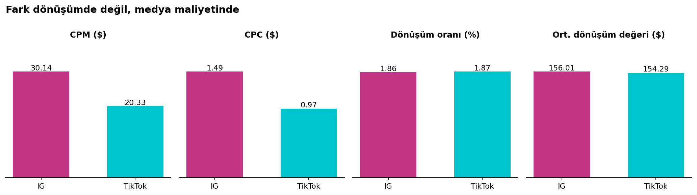
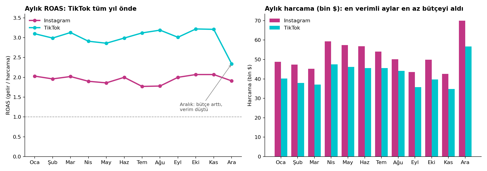

# Instagram ve TikTok Reklam Analizi

Bu proje bir eğitim ödevi olarak başladı. Senaryo şöyleydi: Netflix'in pazarlama ekibinde çalışıyorum ve reklam direktörü yıl boyunca sosyal medya reklamlarına harcadığımız paranın ne getirdiğini soruyor. Bana iki dosya verildi — bir yıllık günlük Instagram ve TikTok reklam verisi.

Google Sheets ile yaptım. Aşağıda hem ne bulduğumu hem de nasıl ilerlediğimi anlattım.

**Veri:** 2025'in her günü için iki kanaldan gösterim, tıklama, harcama, dönüşüm ve gelir. Toplam 730 satır.

---

## Önce şunu anlamam gerekti: bu metrikler ne demek?

Ham veride sadece 5 sayı vardı. Anlamlı bir şey söylemek için bunlardan oran üretmem gerekiyordu:

| Metrik | Ne demek | Nasıl hesapladım |
|---|---|---|
| CTR | Reklamı görenlerin kaçta kaçı tıklamış | Tıklama ÷ Gösterim |
| CPC | Bir tıklama bize kaça mal olmuş | Harcama ÷ Tıklama |
| CPM | 1000 kişiye reklam göstermek kaça mal olmuş | Harcama ÷ (Gösterim / 1000) |
| Dönüşüm oranı | Tıklayanların kaçta kaçı müşteri olmuş | Dönüşüm ÷ Tıklama |
| CPA | Bir müşteri kazanmak kaça mal olmuş | Harcama ÷ Dönüşüm |
| Ort. dönüşüm değeri | Bir müşteri ortalama ne kadar harcamış | Gelir ÷ Dönüşüm |
| ROAS | Harcadığımız 1 dolar kaç dolar geri getirmiş | Gelir ÷ Harcama |

ROAS bu işin ana sorusu. 2x demek, harcadığın her 1 dolar 2 dolar gelir getirmiş demek.

---

## Yıl sonu tablosu

|  | Instagram | TikTok |
|---|---:|---:|
| Harcama | $624.905 | $510.905 |
| Gelir | $1.213.255 | $1.522.890 |
| **ROAS** | **1,94x** | **2,98x** |
| Dönüşüm | 7.777 | 9.870 |
| CPA | $80,35 | $51,76 |
| CPM | $30,14 | $20,33 |
| CPC | $1,49 | $0,97 |
| CTR | %2,02 | %2,10 |
| Dönüşüm oranı | %1,86 | %1,87 |
| Ort. dönüşüm değeri | $156,01 | $154,29 |

Toplamda $1,14 milyon harcanmış, $2,74 milyon gelir gelmiş.

---

## Bulgu 1: TikTok daha iyi — ama sandığım sebepten değil

TikTok'un ROAS'ı 2,98x, Instagram'ınki 1,94x. İlk düşüncem "demek ki TikTok kitlesi daha çok satın alıyor" oldu. Kontrol ettim ve yanılmışım:



- Tıklayanların müşteri olma oranı iki kanalda neredeyse birebir aynı: %1,86 ve %1,87
- Müşteri başına ortalama gelir de aynı: $156 ve $154

Yani reklamı tıklayan insan iki platformda da aynı şekilde davranıyor. Fark tamamen **trafiğin fiyatında.** Instagram'da 1000 kişiye reklam göstermek %48 daha pahalı, bir tıklama almak %54 daha pahalı.

Bu bana ilginç geldi çünkü sorunun nerede olmadığını da söylüyor: reklam içeriğinde ya da hedeflemede bir sorun yok, dönüşüm tarafı gayet sağlıklı. Sorun sadece Instagram'da reklam alanının pahalı olması.

## Bulgu 2: Aralık ayı yanıltıcı

Aralık'ta iki kanalda da bütçe ciddi arttı. Tabloya şöyle bakınca "harika bir ay" gibi duruyor: TikTok'ta yılın en yüksek dönüşüm sayısı (1.034 müşteri). Ama yanına maliyeti koyunca durum değişiyor:

| TikTok | Kasım | Aralık |
|---|---:|---:|
| Harcama | $34.809 | $56.662 (+%63) |
| CPM | $18,49 | $28,47 (+%54) |
| Ort. dönüşüm değeri | $161,91 | $128,49 (−%21) |
| **ROAS** | **3,21x** | **2,34x** |

Bütçeyi artırınca reklam alanı pahalılaşmış, gelen müşteriler de daha az para harcamış. Sonuçta daha fazla müşteri geldi ama her biri hem daha pahalıya mal oldu hem daha az kazandırdı. Aralık, TikTok'un yılın en kötü ROAS ayı.

Buradan öğrendiğim şey: dönüşüm sayısına tek başına bakmak yanıltıyor.

## Bulgu 3: En verimli aylara en az para verilmiş



Ekim ve Kasım her iki kanalda da yılın en verimli ayları (TikTok 3,22x ve 3,21x, Instagram 2,07x ve 2,07x). Aynı zamanda en az bütçe alan aylar. Yani reklam ucuzken az harcanmış, pahalıyken çok.

---

## Direktöre ne söylerdim

1. **Instagram bütçesinin bir kısmını TikTok'a kaydıralım.** Dönüşüm kalitesi aynı olduğu için kaybettiğimiz bir şey yok, sadece daha ucuza trafik alıyoruz. Ama tamamını değil, kademeli — çünkü Aralık verisi TikTok'un da ölçeklenince pahalılaştığını gösteriyor.
2. **Yıl sonu bütçe artışını Ekim–Kasım'a çekelim.** Aralık'ta tek seferde patlatmak yerine, reklamın ucuz olduğu dönemde artıralım.
3. **CPM'i haftalık takip edelim.** Aralık'ta ROAS düşmeden önce ilk bozulan sinyal CPM'di. Dönüşüm sayısı hâlâ artarken bile.

---

## Nasıl yaptım

Google Sheets'te üç aşamalı ilerledim:

1. **Ham veri** — dokunmadım, olduğu gibi durdu
2. **Performans metrikleri** — her gün için CTR, CPC, CPM, dönüşüm oranı hesapladım
3. **Aylık özet** — `SUMIF` ile ay bazında topladım, ROAS'ı buradan çıkardım
4. **Summary** — direktörün sorularının cevapları ve iki kanalın karşılaştırması

`MONTH()` ile tarihten ay numarası çıkarıp `SUMIF` ile gruplama kısmı en çok zorlandığım yerdi. Pivot table kullanmadan formülle yapmak istedim, böylece ne olduğunu gerçekten anlayabildim.

**Bir de temizlik işi vardı:** İki dosyanın kolon isimleri farklıydı (`Date` ve `submit_date`, biri büyük harf biri küçük). Karşılaştırma yapabilmek için ikisini aynı düzene çevirmem gerekti.

**Küçük ama önemli bir karar:** Oranları hesaplarken günlük oranların ortalamasını almak yerine, toplamları birbirine böldüm. Örneğin yıllık CPC için "günlük CPC'lerin ortalaması" değil, "toplam harcama ÷ toplam tıklama". Çünkü ilk yöntem, çok az tıklama alan bir günü çok tıklama alan bir günle eşit ağırlıkta sayıyor ve sonucu bozuyor.

---

## Dosyalar

```
├── veri/
│   ├── instagram_ham_veri.csv     # 365 gün
│   ├── tiktok_ham_veri.csv        # 365 gün
│   └── aylik_ozet.csv             # kanal ve ay bazında tüm metrikler
├── gorseller/
│   ├── kanal_karsilastirma.png
│   └── aylik_performans.png
└── IG_Ad_Performance_Report.xlsx  # Google Sheets çalışmasının indirilmiş hali
```

Google Sheets dosyası: [*(link burada)*](https://docs.google.com/spreadsheets/d/1IJE1s6wpK2YIx2Ct5MYoZGyI_5aUGr2Tyu6cKbXMILI/edit?gid=458775022#gid=458775022)

---

## Bu verinin sınırları

Veri seti eğitim için üretilmiş, gerçek Netflix verisi değil. Sayılar sahte ama analiz yöntemi gerçek.

Ayrıca bu veriyle cevaplayamadığım sorular var:

- Hangi reklamın işe yaradığını bilemiyorum — veride kampanya, görsel ya da hedef kitle kırılımı yok.
- Bir kullanıcı TikTok'ta reklamı görüp Instagram'dan satın almış olabilir. Bu veri her kanalı ayrı ayrı gösteriyor, aralarındaki etkiyi ölçemiyorum.
- Gelir var ama maliyet yok. Yani kâr değil, ciro konuşuyorum. Gerçek kârlılık için ürün maliyetleri gerekirdi.

---

## Ne öğrendim

- Tek bir metriğe bakmanın yanıltıcı olduğunu. Aralık'ta dönüşüm rekoru kırılmıştı ama aslında yılın en kötü ayıydı.
- İki sayı arasındaki farkı görmenin yetmediğini — asıl iş, farkın *nereden* geldiğini bulmak. TikTok daha iyi demek kolaydı; neden daha iyi olduğunu bulmak asıl analiz kısmıydı.
- Ortalama alırken neyin ortalamasını aldığına dikkat etmek gerektiğini.
